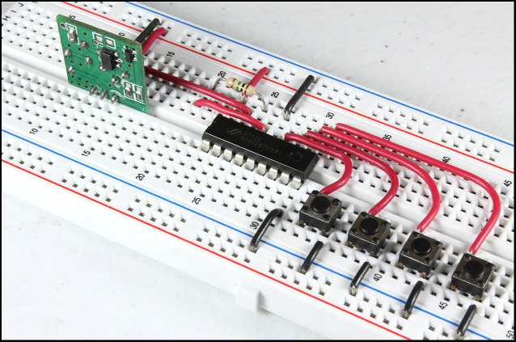

# O errado que acabou melhor
Nós esquecemos de pegar as chaves do laboratório para o minicurso de testes unitários, de última hora conseguimos usar a sala da empesa júnior. Era bem menor e todos ficamos em volta de uma mesa no centro. No laboratório cada um teria um computador e estariam dispostos em fila, além de usar o datashow. Na salinha nós tínhamos um monitor central e alguns trouxeram notebook.

Isto alterou bastante a dinâmica e acho que ficou melhor, era muito fácil interrompe, fazer perguntas e considerações, estávamos um no ombro do outro. Logo as pessoas se organizaram como programação em pares e dava pra passar o cabo do monitor pra clonar o que cada um estava editando e assim todos acompanhavam. 

# O hábito faz o monge
Meu primeiro interesse no minicurso era apresentar concentos mais avançados de javascript, queria chegar em composição e injeção de dependências, principalmente fazer isso de forma natural conforme se tenta simplificar o código quando a estrutura já está no limite da compreensão.

Para me aquecer comecei a fazer testes no estilo TDD no meu trabalho. Devia ter feito isso antes! Vale a pena fazer testes mesmo se acontecer uma catástrofe e você perder todos os testes. O exercício de fazer testes guia o seu estilo a um código melhor.

O objetivo final não é ter os testes e garantir a conformidade do código a uma especificação, a maior vantagem é que seu código é testável. Significa que seu raciocínio está isolável e independente. Melhor do que ter os testes é o código ser testável.

Você acaba desenvolvendo seu raciocínio dentro dos testes e eles são um ambiente seguro, limpo e bem iluminado. Depois que esta joia está pronta e lapidada você incorpora ela no código. 

# Espada de thundera
O código base para o minicurso já estava pronto há alguns meses, eu tinha deixado várias armadilhas para que o tropeço dos alunos fossem a deixa para uma explicação ou a introdução de algum novo conceito. Claro que eu mesmo esquecia e cai em várias delas. Mas os testes servem pra isso, um corrimão pra te segurar caso você perca o equilíbrio e indicar o caminho.

É como se você tivesse sensores em todo o código que ao menor sinal de anomalias disparam o alarme antes que o problema desencadeie uma cascata de funcionamento incorreto. Ou pior, quando estes defeitos ainda não desencadeiam um funcionamento incorreto aparente e eles se acumulam sem serem notados.

Este radar consegue seguir o rastro de pólvora e destacar no mapa aonde as falhas estão. Idealmente o teste deveria identificar a origem do problema, mas outro alívio ainda maior é garantir quais partes do código permanecem funcionando corretamente. Então, mesmo que não se saiba como desenrolar o defeito, pelo menos eliminamos a preocupação sobre boa parte do código.

# Quem é de verdade sabem quem é de mentira
A discussão sobre o uso de mock causa muitas controvérsias, temos frameworks que facilitam e padronizam o uso enquanto que alguns autores consideram uma blasfêmia, no limitem sempre concordam que tudo que causa um efeito colateral só dá pra ser testado com mock.

Tipicamente os mocks aparecem quando você precisa pular etapas, ou porque essa etapa não está disponível localmente ou quando você é preguiçoso mesmo. Existem boas justificativas pra ser preguiçoso, ou pra pelo menos começar preguiçoso, mas a tendência comum é dos mocks irem minguando conforme a qualidade dos testes e dos códigos melhoram.

## Repetir é bom
O propósito dos testes é diferente do código, por isso as boas práticas para ambos divergem. A preocupação nos testes é a legibilidade mesmo em detrimento do desempenho ou da não repetição, primeiro porque frameworks de testes geralmente implementam artifícios para que a rotina de teste execute com velocidade suficiente.

Segundo, os testes são lidos isolados pelo desenvolvedor, em cada um dele deve conter em si mesmo tudo o que for necessário para sua inicialização e configuração, estados não devem ser compartilhados. Por exemplo, num teste você coloca num objeto vários atributos e o passa para a função testada, num segundo caso esse objeto possui apenas algumas variações, mesmo assim o objeto deve ser criado novamente de forma explícita e não reaproveitar o objeto anterior fazendo algumas alterações. Desta forma o programador não precisa percorrer outros lugares para ler os parâmetros utilizados.

Um mau exemplo seria num arquivo de testes havendo vários casos você coloca no primeiro algo que crie uma forma específica de dado e ele permanece até o segundo caso de teste, que por sua vez verifica se uma modificação acontece corretamente. No último caso de testes você verifica que a remoção do dado acontece de forma correta, assim essa variável é criada no primeiro teste, modificada no segundo e deletada no terceiro. Desta forma você está acoplando um teste com os outros, quando você precisar verificar o erro em um dos casos vai precisar entender o arquivo inteiro. 

## Não é retabalho, é parcelamento
Uma crítica comum aos testes é que parece ser necessário produzir mais código para chegar ao mesmo objetivo, os defensores dizem que este custo extra acaba se pagando a médio prazo. Gostaria de adicionar outra perspectiva, o que você desenvolve no teste acaba sendo reciclado e se transforma no código da implementação.

Primeiro acontece um planejamento claro de quais vão ser as entradas e as saídas da função,  o __prototype__ ou assinatura dela. Depois o algoritmo que você desenvolve para validar o retorno da função testada é o embrião da implementação. Talvez nesse momento uma implementação correta ainda não tenha surgido na sua mente, você vai desenvolvendo casos específicos e menores até que o padrão surja diante dos seus olhos, ao generalizar a validação para qualquer entrada você descobre a função. O melhor que fica fácil testar para casos limites ou absurdos 

Desta forma você não está programando duas vezes, está parcelando o desenvolvimento em casos gradativamente mais complexos. Você se apoia no framework para conseguir isolar estas partes de tal forma que consiga as reconduzir e as realinhar na implementação final.

## Apenas renomeações
O que é desenvolvido dentro dos testes acaba migrando para outros arquivos, se não para a função testada, para outros módulos, que também devem possuir seus testes, restando apenas o trabalho de ligar os fios certos nos lugares certo.

Se dentro do teste você precisar desenvolver alguma lógica para verificar o resultado provavelmente esta lógica também está sendo requisitada dentro da implementação e vale a pena tornar isso um módulo próprio que tanto o teste quanto a função implementada fazem uso.

Um padrão comum é o `Arrange Act Assert`. Num primeiro bloco dentro do teste você importa dados e funções que serão organizados e passados para a função que está sendo testada, depois esta função é executada e por fim o retorno dela é comparado com um gabarito. Repare que não deve existir lógicas complicadas dentro dos testes, apenas a modelagem dos argumentos para ficar no padrão apropriado para a função.

### __Melhor do que ter os testes é o código ser testável__