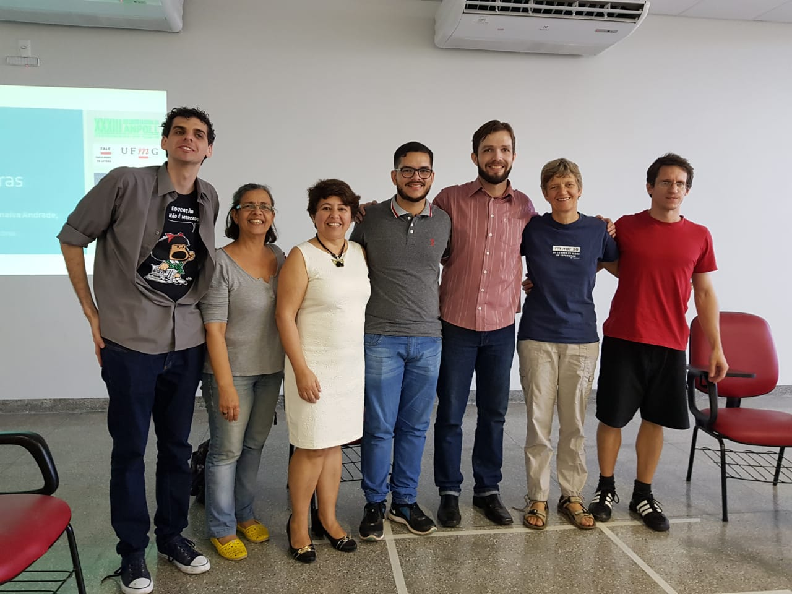
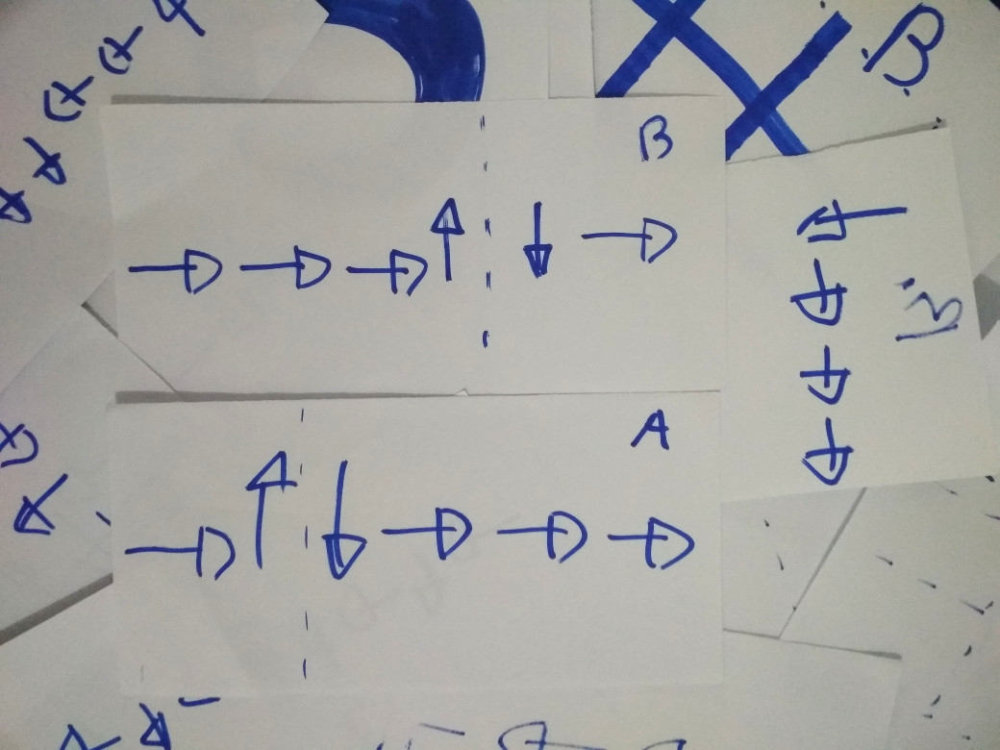

# 23º ENANPOLL - Libras
Apresentei  um  trabalho dia 28 de junho de 2018, foi como um inseto tentando
pegar carona no para-brisa do ônibus. Acho que fiquei balançando os braços
feito um boneco de posto e eles pensaram "tadinho, deve ter problemas".



Foi bacana. Na foto: Elias Paulino, Regina Campelo, Elidéa Bernardino,
Magno Prates, Adriano Gianotto, Rachel Sutton Spence, eu :D

Elidéia chama o espaço sub-rogado de "Ação Construída", mostrou um exemplo
acontecendo espontaneamente com ouvintes num programa tipo Jô Soares.

O poema "[A bolinha de ping-pong](https://www.youtube.com/watch?v=VhGCEznqljo)"
apareceu em várias apresentações.

Rachel escreveu [este](https://www.amazon.com/Introducing-Sign-Language-Literature-Creativity/dp/1137363819)
livro. Sinalizou sobre criação de glosas/vocabulários para literatura surda.
Isto me faz pensar sobre um *Elan As A Service*, com um esquema de
compartilhamento como do github.

## Ensino de programação como ferramenta de apoio pedagógico ao letramento de crianças surdas
O meu banner é [este](ensinoDeProgramacaoComoFerramentaDeApoioPedagogicoAoLetramentoDeCriancasSurdas.pdf).
São universos separados. O pessoal da programação não sabem nada de pedagogia,
não imaginam usar técnicas de ensino de uma segunda língua para algorítmicos. Os
surdo não sabem que o ensino de programação tem o mesmo problema de compreender
uma comunicação não é acessível naturalmente.

No piso dá pra ver umas fitas que preguei, eram pra marcar um mapa 3x3
quadriculado. O meu texto eram setinhas que movimentavam os participantes para
fazer ações no cenário. Com isto dá pra inventar muitos jogos.

O surdo não tem acesso aos sons, o fonema das palavras não fazem sentido,
torna o registro incabível. Minha solução foi registrar movimentos,
as setinhas eram o 'fonema'. Pouco importa qual é a unidade, desde que seja
acessível, o importante é desenvolver e treinar as operações sobre estas
unidades.

A primeira função da escrita é o registro. O conjunto de setinhas eram escritas
e podiam ser executadas depois, podiam ser 'lidas'. Com o texto na sua frente,
na mesa de cirurgia, dá pra pensar com calma, talvez eu tenha infringido
alguma regra, como sair do mapa, ou talvez eu queira fazer um movimento, como a
diagonal, que precise ser representada decompondo em catetos.



Uma das brincadeiras consistia em manusear subtrechos e os combinar. Uma rota,
que passa pelo ponto A, era dividida em A1 e A2, assim também com B. Desta
forma:

```
A = A1, A2.
B = B1, B2.

AB = A1, ->, ->, B2
```

Estamos construindo abstrações para representar certa complexidade e a
gerenciar. Ao invés de lidar com um acumulado de setinhas, damos um nome e a
tomamos como representantes.

O objetivo é a criança começar a manusear o texto brincando, claro que isto
não é língua português, mas todo o raciocínio sintático pode ser germinado.
Você está escrevendo e lendo, colocando a mensagem num recipiente que outra
pessoa, talvez desconhecida, em outro lugar e em outro tempo, pode recuperar.
Você está usando a escrita pra chegar a representar ideias que seriam
complicadas demais sem ela. Além disso, o lúdico pode incentivar a
experimentação e a curiosidade, os livros não são mais muros, tornam-se uma
brincadeira a ser descoberta.

Regina indicou que a faixa etária mais apropriada seria de 0 a 5 anos.
