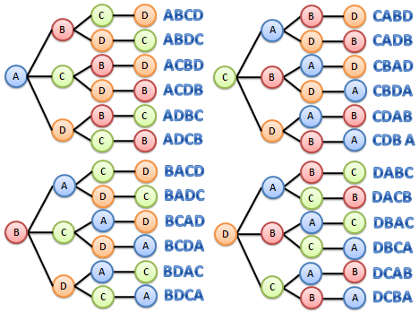

# Permutações & Geradores

Quando embaralhamos as cartas de um baralho estamos escolhendo uma das permutações possíveis. Achar as permutações de um conjunto é descobrir todas as formas que todos os elementos podem ser distribuídos.




Uma maneira intuitiva de elaborar isso é pelo método de contagem que aprendemos na escola para introduzir o fatorial. Dado um conjunto de tamanho n, você escolhe um destes elementos, restando n - 1,  mas poderia ser qualquer dos outros. O código a seguir exemplifica isso:
```javascript
const arr0 = ['a', 'b', 'c', 'd']

const iLess = (arr, i) => arr.slice(0, i).concat(arr.slice(i + 1))
const onesOf = arr => arr.map((e, i, l) => ({"i": e, "iLess": iLess(l, i)}))

console.log(`As ${arr.length} possibilidades de escolher 1 elementos são: ${JSON.stringify(onesOf(arr0), null, 4)}`)
```

O processo deve ser iterado até que tenha apenas um elemento pra ser escolhido, do conjunto n - 1 escolhe outro pelo mesmo método sucessivamente. Isto gera uma árvore com o primeiro nível com n elementos, depois cada um deste elemento tem seu subnível com n - 1:

```javascript
const P0 = {
  "iLess": arr0,
  "i": ''
}

function permNet (p) {
  if (p.iLess.length > 1) {
    p.iLess = onesOf(p.iLess)
    p.iLess.forEach(permNet)
  }
}

permNet(P0)

console.dir(P0)
```

Da árvore acima ainda seria necessário percorrê-la para coletar a ordem dos elementos `i` escolhidos. Serve aqui para brincarmos interativamente com a árvore e entender suas simetrias. Utilize um vetor inicial com mais elementos, acima de 10 na minha máquina já começa a travar.

Para não gerar a árvore e já obter os elementos do vetor poderíamos usar o código a segui:
```javascript

const arrIDistF = (arr, el) => arr.length > 0 ? arr.map(e => el + e) : [el]

function perm (arr) {
  const output = []
  for (let i = 0; i < arr.length; i++) {
    const iless =  iLessF(arr, i)
    const permiless = perm(iless)
    const arridist = arrIDistF(permiless, arr[i])
    output.push(...arridist)
  }
  return output
}

// Forma mais compacta
// 
// const perm = arr => arr.reduce(
//  (a, b, i, lst) => a.concat(
//    ...arrIDist(perm(iLess(lst, i)), b)
// ), [])
```
