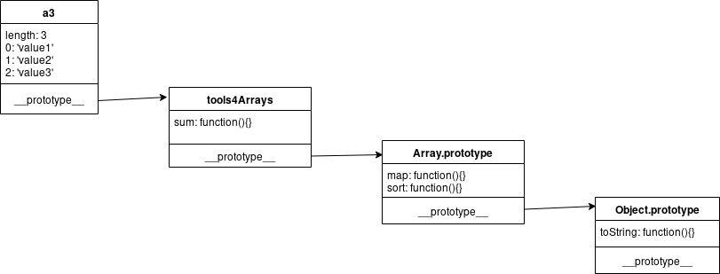

# Protótipos intermediários
## Introdução
Javascript é uma linguagem com herança prototípica, os atributos não encontrados
de um objeto são procurados no objeto vinculado como protótipo do primeiro. O
segundo objeto pode ter um terceiro vinculado pelo próprio protótipo e assim
sucessivamente. É como se fosse uma lista encadeada.
```javascript
// corrente.js
var a = []
var pa = Object.getPrototypeOf(a)
Object.getOwnPropertyNames(pa).join('\n')
```
O protótipo do objeto `Object` é o oceano onde todas as cadeias de protótipos
deságuam. E o protótipo deste objeto é `null`. 
```javascript
// oceano.js
var a = []
var pa = Object.getPrototypeOf(a)
var ppa =  Object.getPrototypeOf(pa)

var o = {}
var po = Object.getPrototypeOf(o)

ppa === po
```
Vários objetos diferentes podem possuir o mesmo protótipo, o código nele presente
passa a poder ser acessado por todos esses filhos. É um mecanismo similar às
classes em orientação a objeto, porém com protótipos a herança acontece por
objetos manuseáveis durante a execução do programa.
## MDN
Abaixo vários links para documentação relacionada:
- [create](https://developer.mozilla.org/en-US/docs/Web/JavaScript/Reference/Global_Objects/Object/create)
- [PrototypeOf](https://developer.mozilla.org/en-US/docs/Web/JavaScript/Reference/Global_Objects/Object/getPrototypeOf)
- [assign](https://developer.mozilla.org/en-US/docs/Web/JavaScript/Reference/Global_Objects/Object/assign)
- [PropertyDescriptors](https://developer.mozilla.org/en-US/docs/Web/JavaScript/Reference/Global_Objects/Object/getOwnPropertyDescriptors)
- [defineProperties](https://developer.mozilla.org/en-US/docs/Web/JavaScript/Reference/Global_Objects/Object/defineProperties)
- [constructor](https://developer.mozilla.org/en-US/docs/Web/JavaScript/Reference/Global_Objects/Object/constructor)

## Tipo vetor
`Array` é um dos objetos especializados do javascript, seu protótipo aponta para
o protótipo base do `Object` e possui diversos métodos para lidar com seus
elementos, como `reduce` ou `sort`. Mesmo assim é possível adicionar atributos
não numéricos a um objeto do tipo array:
```javascript
var a = []
a.a = a
a.b = 'b'
a[-1] = 'negativo'

// a['2'] = 'third'
a.push('first')
a.push('second')


for(let i in a){
  console.log(`a[${i}] = ${a[i]}`)
}

console.log(a.join(', '))
```
Podemos criar algo similar a um vetor a partir de objetos mimetizando seus
atributos iniciais e seu protótipo:
```javascript
var mkArray = () => Object.assign(
  Object.create(
    Object.getPrototypeOf([])
  ),
  { 'length': 0 }
)

var a = mkArray()
a.push('first')
a.push('second')
a['2'] = 'third'

for(let i in a){
  console.log(`a[${i}] = ${a[i]}`)
}
console.log(a.join(', '))

console.log(Object.getOwnPropertyDescriptors([]).length)
console.log(Object.getOwnPropertyDescriptors(a).length)
```
Repare que o atributo `length` possui um comportamento dissonante, ainda é
necessário alterar algumas das suas descrições:
```javascript
var mkArray = () => Object.defineProperty(
  Object.create(
    Object.getPrototypeOf([])
  ),
  'length',
  {
    'value': 0,
    'writable': true,       // not default
    'configurable': false,  //default
    'enumerable': false     //default
  }
)
var a = mkArray()
console.log(Object.getOwnPropertyDescriptors([]).length)
console.log(Object.getOwnPropertyDescriptors(a).length)
```
## Herança
Para adicionar o comportamento de soma podemos colocar um método em um destes
vetores, isto implica que cada um dos objetos terá sua cópia da função. Para
aliviar o uso da memória podermos colocar esta função num objeto externo e apenas
a referencia no atributo do vetor. Nesse sentido um objeto externo privilegiado
seria o protótipo, onde a busca por referência já é feita automaticamente.
```javascript
var a1 = [1, 1, 1]
a1.sum = function sum () {
  return this.reduce((a, b) => a + b, 0)
}
console.log(`a1.sum() = ${a1.sum()}`)

var tools4Arrays = {}
tools4Arrays.sum = function sum () {
  return this.reduce((a, b) => a + b, 0)
}
var a2 = [2,2,2]
a2.sum = tools4Arrays.sum
console.log(`a2.sum() = ${a2.sum()}`)

var a3 = [3, 3, 3]
Object.getPrototypeOf(a3).sum = function() {
  return this.reduce((a, b) => a + b, 0)
}
console.log(`a3.sum() = ${a3.sum()}`)

console.log(`now everyone has sum() = ${[4, 4, 4].sum()}`)
```
Contudo alterar o protótipo de um objeto que outra parte da aplicação faz uso
pode impactar silenciosamente na execução do programa.

## Mix In
Um alternativa seria, ao invés de alterar o protótipo diretamente, adicionar um
elo na cadeia que contenha os atributos necessários e este elo ter seu protótipo
apontado para o protótipo original, desta forma os atributos do objeto
intrometido são consultados se não existir este atributo no objeto inicial, por
sua vez se não for localizado no neste intermediário a busca seque através cadeia
de prototípica.



```javascript
var protoOfArray = Object.getPrototypeOf([])

var tools4Arrays = Object.defineProperty(
  Object.create(protoOfArray),
  'sum',
  {
    'value': function sum () {
        return this.reduce((a, b) => a + b, 0)
      },
    'writable': false,
    'configurable': false,
    'enumerable': false
  }
)

var a3 = Object.setPrototypeOf(new Array(0), tools4Arrays)
a3[0] = 3
a3[1] = 3
a3[2] = 3

console.log(`a3.sum() = ${a3.sum()}`)
console.error(`just a3 has sum() = ${[4, 4, 4].sum()}`)
```

Os atributos originais na cadeia protótipa continuam acessíveis (se não forem
sobrescritas), como por exemplo `sort`. Tudo se passa como se este objeto fosse
um array, mas com alguns atributos curto-circuitados na hierarquia das heranças.

## Construtores
```javascript
var protoOfArray = Object.getPrototypeOf([])

var tools4Arrays = Object.defineProperty(
  Object.create(protoOfArray),
  'sum',
  {
    'value': function sum () {
        return this.reduce((a, b) => a + b, 0)
      }
  }
)
tools4Arrays = Object.defineProperty(
  tools4Arrays,
  'constructor',
  {
    'value': ExtArr
  }
)

function ExtArr (n) {
  return Object.setPrototypeOf(new Array(n), tools4Arrays)
}
Object.setPrototypeOf(ExtArr, tools4Arrays)
ExtArr[Symbol.species] = ExtArr


var a3 = ExtArr(3)
a3[0] = 3
a3[1] = 3
a3[2] = 3

console.log(`a3.filter has sum() = ${a3.filter(() => true).sum()}`)
console.log(`a3.fmap has sum() = ${a3.map(x => x).sum()}`)
```
Mas estas funções que retornam um novo
objeto precisam saber criar estes sub tipos especializados, por enquanto t