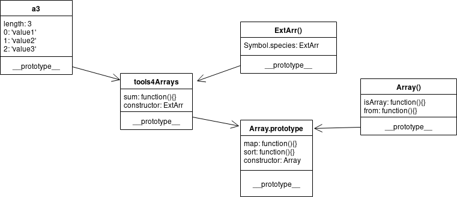

# Protótipos intermediários
## Introdução
Javascript é uma linguagem com herança prototípica, os atributos não encontrados
de um objeto são procurados no objeto vinculado como o protótipo do primeiro. O
segundo objeto pode ter um terceiro vinculado pelo próprio protótipo e assim
sucessivamente. É como se fosse uma lista encadeada. O protótipo dos arrays
possuem os seguintes atributos:
```javascript
// corrente.js
var a = []
var pa = Object.getPrototypeOf(a)
Object.getOwnPropertyNames(pa).join('\n')
```
O protótipo do objeto `Object` é o oceano onde todas as cadeias de protótipos
deságuam. E o protótipo deste objeto é `null`. 
```javascript
// oceano.js
var a = []
var pa = Object.getPrototypeOf(a)
var ppa =  Object.getPrototypeOf(pa)

var o = {}
var po = Object.getPrototypeOf(o)

ppa === po
```
Vários objetos diferentes podem possuir o mesmo protótipo, o código nele presente
passa a poder ser acessado por todos esses filhos. É um mecanismo similar às
classes em orientação a objeto, porém com protótipos a herança acontece por
objetos manuseáveis durante a execução do programa.
## MDN
Abaixo vários links para documentação relacionada:
- [create](https://developer.mozilla.org/en-US/docs/Web/JavaScript/Reference/Global_Objects/Object/create)
- [PrototypeOf](https://developer.mozilla.org/en-US/docs/Web/JavaScript/Reference/Global_Objects/Object/getPrototypeOf)
- [assign](https://developer.mozilla.org/en-US/docs/Web/JavaScript/Reference/Global_Objects/Object/assign)
- [PropertyDescriptors](https://developer.mozilla.org/en-US/docs/Web/JavaScript/Reference/Global_Objects/Object/getOwnPropertyDescriptors)
- [defineProperties](https://developer.mozilla.org/en-US/docs/Web/JavaScript/Reference/Global_Objects/Object/defineProperties)
- [constructor](https://developer.mozilla.org/en-US/docs/Web/JavaScript/Reference/Global_Objects/Object/constructor)

## Tipo vetor
`Array` é um dos objetos especializados do javascript, seu protótipo aponta para
o protótipo base do `Object` e possui diversos métodos para lidar com seus
elementos, como `reduce` ou `sort`. Mesmo assim é possível adicionar atributos
não numéricos a um objeto do tipo array:
```javascript
// tipoVetor1.js
var a = []
a.a = a
a.b = 'b'
a[-1] = 'negativo'

// a['2'] = 'third'
a.push('first')
a.push('second')


for(let i in a){
  console.log(`a[${i}] = ${a[i]}`)
}

console.log(a.join(', '))
```
Podemos criar algo similar a um vetor a partir de objetos mimetizando seus
atributos iniciais e seu protótipo:
```javascript
var mkArray = () => Object.assign(
  Object.create(
    Object.getPrototypeOf([])
  ),
  { 'length': 0 }
)

var a = mkArray()
a.push('first')
a.push('second')
a['2'] = 'third'

for(let i in a){
  console.log(`a[${i}] = ${a[i]}`)
}
console.log(a.join(', '))

console.log(Object.getOwnPropertyDescriptors([]).length)
console.log(Object.getOwnPropertyDescriptors(a).length)
```
Repare que o atributo `length` possui um comportamento dissonante, ainda é
necessário alterar algumas das suas descrições:
```javascript
var mkArray = () => Object.defineProperty(
  Object.create(
    Object.getPrototypeOf([])
  ),
  'length',
  {
    'value': 0,
    'writable': true,       // not default
    'configurable': false,  //default
    'enumerable': false     //default
  }
)
var a = mkArray()
console.log(Object.getOwnPropertyDescriptors([]).length)
console.log(Object.getOwnPropertyDescriptors(a).length)
```
## Herança
Para adicionar o comportamento de soma podemos colocar o método nos vetores, isto
implica que cada um dos objetos terá sua cópia da função. Para aliviar o uso da
memória podermos colocar esta função num objeto externo e apenas a referencia no
atributo do vetor. Nesse sentido um objeto externo privilegiado seria o protótipo,
onde a busca por referência já é feita automaticamente.
```javascript
// heranca.js
var a1 = [1, 1, 1]
a1.sum = function sum () {
  return this.reduce((a, b) => a + b, 0)
}
console.log(`a1.sum() = ${a1.sum()}`)

var tools4Arrays = {}
tools4Arrays.sum = function sum () {
  return this.reduce((a, b) => a + b, 0)
}
var a2 = [2,2,2]
a2.sum = tools4Arrays.sum
console.log(`a2.sum() = ${a2.sum()}`)

var a3 = [3, 3, 3]
Object.getPrototypeOf(a3).sum = function() {
  return this.reduce((a, b) => a + b, 0)
}
console.log(`a3.sum() = ${a3.sum()}`)

console.log(`now everyone has sum() = ${[4, 4, 4].sum()}`)
```
Contudo alterar o protótipo de um objeto que outra parte da aplicação faz uso
pode impactar silenciosamente na execução do programa.

## Mix In
Um alternativa seria, ao invés de alterar o protótipo diretamente, adicionar um
elo na cadeia que contenha os atributos necessários e este elo ter seu protótipo
apontado para o protótipo original, desta forma os atributos do objeto
intrometido são consultados se não existir este atributo no objeto inicial, por
sua vez se não for localizado neste intermediário a busca segue através da cadeia
prototípica.


```javascript
// mixin.js
var protoOfArray = Object.getPrototypeOf([])

var tools4Arrays = Object.defineProperty(
  Object.create(protoOfArray),
  'sum',
  {
    'value': function sum () {
        return this.reduce((a, b) => a + b, 0)
      },
    'writable': false,
    'configurable': false,
    'enumerable': true
  }
)

var a3 = Object.setPrototypeOf(new Array(0), tools4Arrays)
a3[0] = 3
a3[1] = 3
a3[2] = 3

console.log(`a3.sum() = ${a3.sum()}`)
console.error(`just a3 has sum() = ${[4, 4, 4].sum()}`)
```

Os atributos originais na cadeia protótipa continuam acessíveis (se não forem
sobrescritas), como por exemplo `sort`. Tudo se passa como se este objeto fosse
um array com alguns atributos curto-circuitados na hierarquia das heranças.

## Construtores
O conceito de construtor está presente desde as primeiras especificações e lembra
o comportamento de uma Classe, ele define uma função que gera novos objetos e se
convenciona usar letra inicial maiúscula. A função construtura deve possuir o
protótipo igual aos objetos que cria e estes devem acessar um atributo
`constructor` que aponta para esta função.
```javascript
// constructor.js
var protoOfArray = Object.getPrototypeOf([])

var tools4Arrays = Object.defineProperty(
  Object.create(protoOfArray),
  'sum',
  {
    'value': function sum () {
        return this.reduce((a, b) => a + b, 0)
      },
      'enumerable': true
  }
)
tools4Arrays = Object.defineProperty(
  tools4Arrays,
  'constructor',
  {
    'value': ExtArr
  }
)

function ExtArr (n) {
  return Object.setPrototypeOf(new Array(n), tools4Arrays)
}
ExtArr.prototype = tools4Arrays


var a3 = ExtArr(3)
a3[0] = 3
a3[1] = 3
a3[2] = 3

console.log(`Array.isArray(a3) = ${Array.isArray(a3)}`)
console.log(`a3 instanceof Array = ${a3 instanceof Array}`)
console.log(`a3 instanceof ExtArr = ${a3 instanceof ExtArr}`)
```
No código acima já obtemos que `a3 instanceof ExtArr` é verdadeira, onde `ExtArr`
é a função construtora que fabrica novos objetos. De forma análoga `Array` é a
função construtora de vetores, `Object` é a função construtora de objetos e
função construtora das funções anteriores é a `Function`, que é função
construtora de si mesma e uma instância de `Object`.


A função `ExtArr` constrói novos vetores estendidos com os atributos contidos em
`tools4Arrays`. Quando tenta-se acessar `a3.constructor` o atribulo não é
encontrado no próprio objeto, depois segue pelo protótipo e em `tools4Arrays`
encontra e o retorna. Ao se buscar `a3.map` o atributo não é encontrado em
`tools4Arrays` e segue para `Array.prototype`.

Funções como `map` e `filter` geram novos objetos, eles seguem a cadeia protótipa
procurando por construtores que possuem o atributo especial `Symbol.species` que
aponta para a função construtora que deve ser usada. Sem configurações adicionais
o atributo `Array[Symbol.species]`, que aponta para o próprio construtor `Array`,
e gera um novo vetor sem as os atributos extras de `tools4Arrays`. Para alterar
isso deve-se adicionar o construtor `ExtArr` o atributo `Symbol.species`
apontando para o construtor desejado:



```javascript
// constructor.js
// (...)

ExtArr[Symbol.species] = ExtArr

console.log(`a3.filter has sum() = ${a3.filter(() => true).sum()}`)
console.log(`a3.map has sum() = ${a3.map(x => x).sum()}`)
```
`Symbol.species` pode apontar para qualquer outra função, neste caso as funções `map` e `filter` vão utilizarão o construtor pela mesma assinatura do `Array`, se for chamada com um argumento numérico n retorna um vetor vazio de comprimento n, se for de outro tipo ou múltiplos argumentos retorna um vetor com estes argumentos. Para atingir isso basta recolher e repassar os argumentos com o operador _spread_, da seguinte forma:
```javascript
// mkExtArr.mjs
/*
** Array(3) = [ , , ]
** Array(3, 3, 3) = [3, 3, 3]
*/
// (...)
const ExtArr = function ExtArr (...n) {
  return Object.setPrototypeOf(new Array(...n), megaPack)
}
// (...)
```

## Empacotando tudo
Se quisermos incorporar diversas funções no protótipo extra podemos utilizar o `Object.defineProperty` com _reduce_ da seguinte maneira:
```javascript
// zipProperty.mjs
function zipProperty (proto, toolsBag) {
  return Object.entries(toolsBag).reduce((a, [key, value]) => Object.defineProperty(
  a,
  key,
  { value,'enumerable': true }
  ), proto)
}
```
Assim refatoramos a função que estende os vetor em javascript com novos atributos para apenas:
```javascript
//  mkExtArr.mjs
function mkExtArr (toolsBag) {
  const tools4Arrays = Object.defineProperty(
    zipProperty(Object.getPrototypeOf([]), toolsBag),
    'constructor',
    {
      'value': ExtArr
    }
  )

  function ExtArr (...n) {
    return Object.setPrototypeOf(new Array(...n), tools4Arrays)
  }
  ExtArr.prototype = tools4Arrays
  ExtArr[Symbol.species] = ExtArr

  return ExtArr
}
```
## Conclusão
Esta técnica é equivalente a _Subclassing Arrays_ e com `Symbol.species` para
restaurar o funcionamento dos `map`. Veja mais [aqui](https://davidtang.io/2017/09/21/subclassing-arrays-in-es2015.html) e [aqui](https://www.keithcirkel.co.uk/metaprogramming-in-es6-symbols/).

Em outas linguagens há algum conceito de dados que é transversal a toda a sintaxe,
como listas para lisp ou objetos para scala. Os tipos especializados de objetos
em javascript, como `Arrays` ou `Set`, possui uma representação interna otimizada,
que mesmo sendo instâncias de objetos, intimida a busca por uma superfície suave
de especialização. Ainda por cima as classes vem bagunçar conceitualmente tudo
ainda mais.

Para incorporar o código pode utilizar algo assim:
```html
<script type="module">
  import mkExtArr from 'https://raw.githubusercontent.com/itacirgabral/blog/master/6/mkExtArr.mjs'
  const SArray = mkExtArr({
    'isNumeric': function isNumeric () { 
      return this.every(Number.isFinite)
    },
    'sum': function sum () {
      return this.isNumeric() ? this.reduce((a, b) => a + b, 0) : new TypeError('should be stric numeric')
    },
    'average': function average () {
      return this.isNumeric() ? this.sum() / this.length : new TypeError('should be stric numeric')
    }
  })

  window.SArray = SArray

  console.log(`statisticalArray(1, 2, 3).average() = ${statisticalArray(1, 2, 3).average()}`)
</script>
```
Ou visitar o [github](https://github.com/itacirgabral/blog/tree/master/6/final.js)