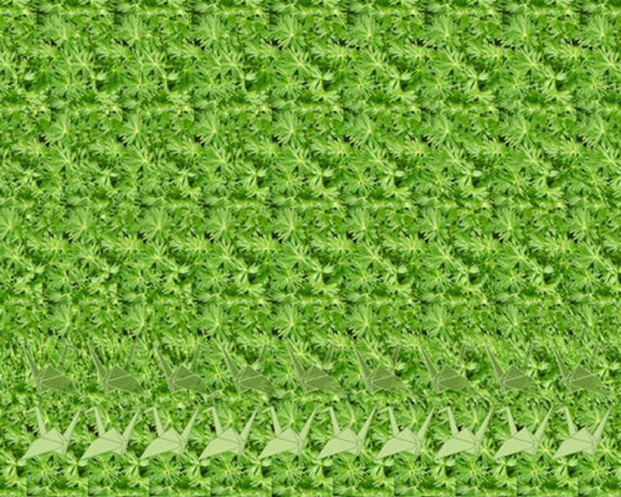

# Estereograma

Lembro que vinham uns estereogramas nos gibis da turma da mônica, mas eu nunca tinha conseguido ver, pelo menos não me lembro de ficar interessado naquilo.

Depois encontrei um livro com versões bem mais complexas, haviam jogos e desafios escondidos naquelas figuras que pareciam só um monte de texturas. Parecia algum tipo de mágica, com o procedimento certo na forma de olhar os desenhos se esculpiam e descobriam uma outra realidade mais profunda.

A cara de surpresa quando alguém conseguia começar a ver era uma mistura de susto, incredulidade e admiração, um novo mundo estava desvendado, toda uma nova dimensão colorida. Era como instalar um *driver* novo e o seu sistema operacional passou a poder acessar aquele periférico e agora você o acessa como se fosse parte dele mesmo.

De alguma forma esta experiência me moldou como uma revelação, acho que ainda procuro repetir isso quando tento meditar ou aprendo uma nova linguagem de programação.