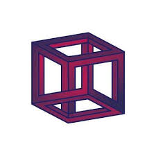
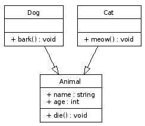
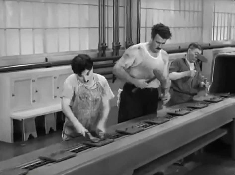

# Blockchain

Participei do [blockmeetMT](https://blockmeetmt.com.br/), inicialmente eu não estava tão entusiasmado, eram poucas as palestras técnicas e estas eram introdutórias. Conheci bitcoin a bastante tempo, quando uma placa de vídeo convencional era suficiente para minerar, a fúria especulativa fez eu manter distância, pra mim isso era uma forma de agiotagem e eu sou mais interessado na tecnologia.

Eu estava enganado, ainda bem que não falaram de programação ou hardware. Os assuntos que mais me impressionaram foram sobre direito e economia. O hype da tecnologia está passando, agora a bolha nerd estoura e começa a impactar áreas práticas trazendo consequências subversivas.

A área de logística pode sofrer uma transformação surpreendente, além de ser um problema complexo por precisar coordenar diversos atores, cada um podendo ter uma regulação externa e uma operação interna muito conflitante um com os outros, os paradigmas da computação comuns no ambiente empresarial modelam mal os conceitos de processos e eventos, segundo [Mathiassen](https://link.springer.com/chapter/10.1007%2F978-1-4471-3016-1_6):

> Objects and events are dual in nature and too much is lost if events are reduced to mere objects.

A tecnologia de blockchain fornece a abstração necessária, ou pelo menos uma infraestrutura, para vincular um elemento ao longo de diversas transformações. Oferece segurança para que o elemento possa ser alterado fora do escopo da empresa, de forma compartilhada e distribuída. É como se toda a cadeia produtiva estivesse ligado a um barramento de comunicação. Antes cada elo conhecia apenas seu consumidor e seu produtos, o seu trabalho tinha a memória apenas desta célula.

Um dos palestrantes deu exemplo da produção de café no espirito santo, mapearam todo o processo desde a fazendo até a cafeteria em são paulo, em cada xícara podia ler um qrcode para saber desde os insumos orgânicos que o agricultor comprou, dia da colheita, tempo e caminho de transporte, etapas de beneficiamento. Perceberam que o transportador entre a fazenda e o primeiro cerealista era o que tinha maior lucro em relação ao capital investido, além de não agregar valor à marca ainda deixava toda a cadeia dependente.

No exemplo do café o palestrante estava preocupado em otimizar o processo retirando um dos elos que tinham comportamento predatório, mas isso pode ir muito além, é uma técnica de anti commodities. Cada produto agora tem uma história, não é mais apenas um preço e características genéricas, carrega consigo a memória do trabalho de todos que participaram.